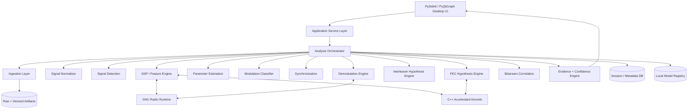
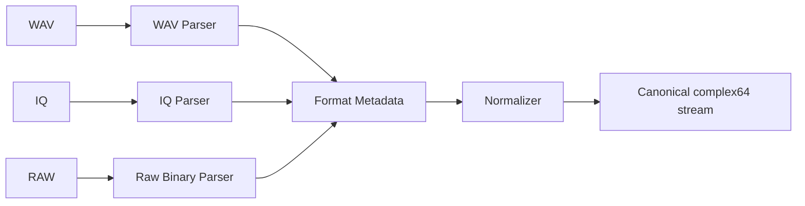
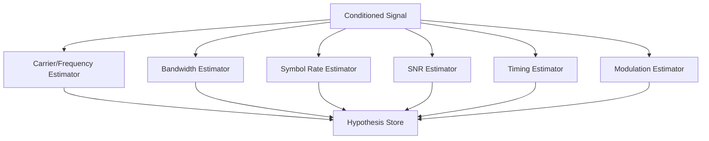
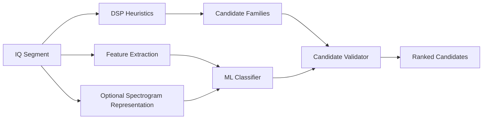
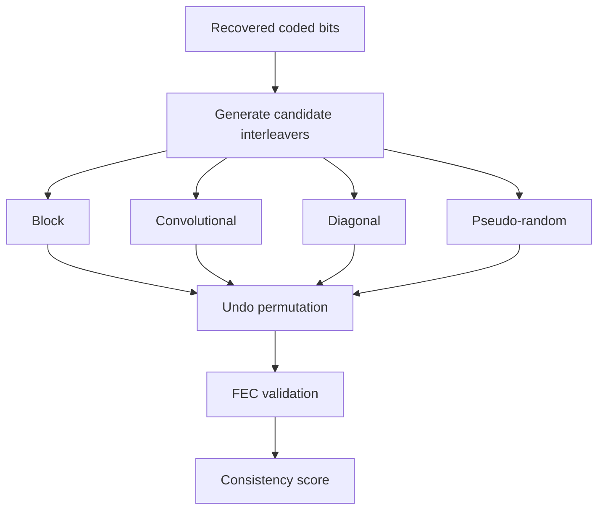
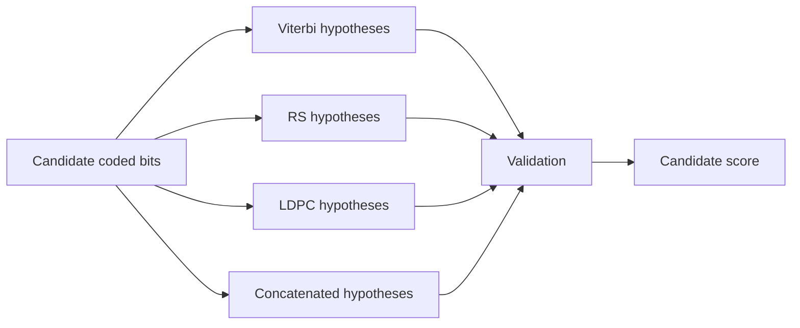
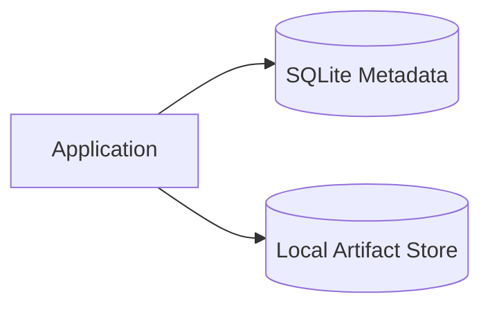
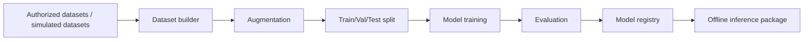

# Automated IQ/WAV Signal Analysis Platform
## Complete Architecture & Build Specification for Gemini 3.8 Flash

**Document type:** Product + Software Architecture Specification  
**Target implementation model:** Gemini 3.8 Flash (`gemini-3.8-flash`)  
**Primary goal:** Build a minimal, premium, Awwwards-level desktop UI over a robust, modular signal-analysis backend.

> **Scope / operating principle**
> The system is intended for authorized signal-processing research, laboratory/test captures, and analysis of supplied IQ/WAV datasets. It should operate offline where required. It must not depend on network access for core inference or DSP processing.

---

# 1. Product Vision

Build a desktop application that turns a raw `.IQ` or `.WAV` capture into an auditable analysis session:

```text
File
  -> ingest
  -> normalize
  -> detect signal regions
  -> visualize
  -> estimate parameters
  -> classify modulation
  -> synchronize
  -> demodulate
  -> test interleaver hypotheses
  -> test FEC hypotheses
  -> correlate bit streams
  -> validate candidates
  -> show evidence + confidence
  -> export report
```

The product should feel like a high-end scientific instrument rather than an engineering utility:

- minimal chrome
- large information surfaces
- dense but readable plots
- keyboard-first interaction
- progressive disclosure
- dark scientific aesthetic
- zero visual clutter
- strong hierarchy between raw observations, inferred parameters, and validated results

The UI is not the product's intelligence. The **analysis engine is the product**; the UI is the instrument panel.

---

# 2. Core Architectural Principle

Do **not** build a single end-to-end black-box AI classifier.

Use a hybrid architecture:

```text
Deterministic DSP
       |
       v
Measured features
       |
       v
Hypothesis generator
       |
       v
Candidate processing chains
       |
       v
Decoder / consistency validation
       |
       v
Evidence aggregation
       |
       v
Confidence-ranked result
```

Every inferred parameter must carry:

```text
value
source
algorithm
confidence
assumptions
validation status
```

Example:

```json
{
  "parameter": "modulation",
  "candidate": "QPSK",
  "confidence": 0.86,
  "evidence": [
    "four phase clusters",
    "constant-envelope behavior",
    "symbol-rate periodicity"
  ],
  "algorithm": "feature_ensemble_v1",
  "validation": "partial"
}
```

---

# 3. System Architecture



---

# 4. Recommended Technology Stack

## Desktop application

| Concern | Choice |
|---|---|
| Language | Python 3.12+ |
| GUI | PySide6 |
| Plotting | PyQtGraph |
| Scientific computing | NumPy, SciPy |
| DSP runtime | GNU Radio |
| ML | PyTorch |
| ML inference optimization | ONNX Runtime where useful |
| Native acceleration | C++17/20 + pybind11 |
| Database | SQLite for MVP; PostgreSQL optional later |
| Serialization | JSON + MessagePack where useful |
| Config | YAML |
| Testing | pytest + CTest |
| Build | CMake + Python packaging |
| Logging | stdlib logging + structured JSON logs |
| Packaging | uv/pip + PyInstaller or native installer |

## Why this split

- Python owns orchestration, UI, experimentation, and ML.
- GNU Radio supplies mature SDR/DSP primitives.
- C++ handles expensive kernels and throughput-sensitive processing.
- SQLite gives a simple local, offline session store.
- Filesystem/object-style storage holds large IQ arrays and derived artifacts.

---

# 5. Canonical Signal Data Model

The rest of the system must not care whether the original file was WAV or IQ.

Define a canonical representation:

```python
@dataclass
class SignalBuffer:
    samples: np.ndarray  # complex64 preferred
    sample_rate_hz: float | None
    center_frequency_hz: float | None
    channel_count: int
    source_format: str  # wav | iq | raw
    sample_format: str  # pcm16 | pcm32 | cf32 | ci16 | etc.
    start_time: float | None
    metadata: dict
```

For every signal segment:

```python
@dataclass
class SignalSegment:
    id: str
    start_sample: int
    end_sample: int
    start_time_s: float
    duration_s: float
    center_frequency_hz: float | None
    bandwidth_hz: float | None
    snr_db: float | None
    metadata: dict
```

---

# 6. Input/Ingestion Architecture



## WAV handling

Read and preserve:

- sample rate
- sample width
- channel count
- encoding
- duration
- channel mapping

## IQ handling

Support configurable formats:

- complex float32
- complex float64
- interleaved int8/int16/int32 IQ
- I-only or Q-only variants where required by the file descriptor

Because raw IQ is often not self-describing, the ingestion UI must permit a small **format configuration dialog**:

```text
Sample type:       int16
Interleaving:      I Q I Q
Endian:            little
Sample rate:       2.4 MHz
Center frequency:  145.000 MHz
Scale:             auto
```

Never silently invent missing metadata. Unknown values remain `unknown` until explicitly supplied or inferred.

---

# 7. Metadata Provenance Model

Every parameter has provenance.

```python
@dataclass
class ParameterEvidence:
    name: str
    value: object
    unit: str | None
    source: str  # file_header | user | estimator | classifier | decoder
    algorithm: str | None
    confidence: float
    assumptions: list[str]
    validation: str  # unverified | partial | validated | rejected
```

Example display:

```text
SAMPLE RATE
2.400 MHz

Source       FILE HEADER
Confidence   100%
Status       VERIFIED
```

versus:

```text
SYMBOL RATE
9.58 kSym/s

Source       SIGNAL ESTIMATOR
Method       cyclic/timing ensemble
Confidence   82%
Status       CANDIDATE
```

---

# 8. Preprocessing Pipeline


All transformations must be represented as immutable pipeline nodes.

Example:

```json
{
  "operation": "resample",
  "input": "segment-12",
  "output": "segment-12-r2",
  "source_rate": 1920000,
  "target_rate": 480000,
  "algorithm": "polyphase"
}
```

Never overwrite the original capture.

---

# 9. Signal Detection

The application should first determine where useful signal energy exists.

```text
full recording
    |
    v
STFT / PSD
    |
    v
noise-floor estimation
    |
    v
threshold / detector
    |
    v
candidate regions
```

Each region gets:

- start/end samples
- duration
- center frequency
- occupied bandwidth
- estimated SNR
- detection score

This allows the user to analyze a huge recording without processing every sample through expensive models.

---

# 10. DSP Feature Engine

Feature families:

### Time domain

- mean
- variance
- RMS
- peak
- crest factor
- amplitude distribution
- envelope statistics

### Frequency domain

- PSD
- peak frequency
- occupied bandwidth
- spectral centroid
- spectral roll-off
- spectral flatness
- spectral symmetry
- sideband structure

### Time-frequency

- STFT
- spectrogram
- burst duration
- frequency transitions
- transient structure

### Statistical / higher-order

- moments
- cumulants
- amplitude statistics
- phase statistics

### Cyclostationary

- cyclic frequencies
- spectral correlation features
- periodicity indicators

Store features in versioned schemas:

```text
feature_set_id
algorithm_version
window_size
hop_size
sample_rate
feature_vector
```

---

# 11. Parameter Estimation Engine

The engine is split by parameter rather than one large estimator.



Important: absolute sampling rate should come from file/acquisition metadata whenever possible. Arbitrary samples do not inherently encode an absolute time unit.

Return normalized and absolute quantities separately:

```text
sample_rate_hz: known/unknown
normalized_symbol_rate: symbols/sample
absolute_symbol_rate: optional
reference_rate: optional
```

---

# 12. Modulation Classification

Use a hybrid model:



Target MVP classes:

- FSK family
- BPSK
- QPSK
- 8PSK
- QAM16
- QAM64

Future expansion:

- MSK/GMSK
- ASK
- OQPSK
- APSK
- OFDM families

Output must be a candidate set, not a single unexplained label.

```json
{
  "candidates": [
    {"name": "QPSK", "score": 0.86},
    {"name": "8PSK", "score": 0.09},
    {"name": "OQPSK", "score": 0.05}
  ]
}
```

---

# 13. Synchronization Engine

Required components:

```text
frequency offset estimation
frequency correction
carrier recovery
phase recovery
timing recovery
matched filtering
symbol clock recovery
```

Architecture:

```text
conditioned signal
      |
      +--> coarse frequency correction
      |
      +--> matched filter
      |
      +--> timing recovery
      |
      +--> carrier/phase recovery
      |
      v
symbol stream
```

Every synchronizer must report convergence metrics.

---

# 14. Demodulation Engine

Use an interface-based architecture:

```python
class Demodulator(Protocol):
    def configure(self, config: DemodConfig) -> None: ...
    def process(self, samples: np.ndarray) -> SymbolStream: ...
    def metrics(self) -> dict: ...
```

Implement:

```text
FSKDemodulator
BPSKDemodulator
QPSKDemodulator
8PSKDemodulator
QAM16Demodulator
QAM64Demodulator
```

Each returns:

- symbols
- hard bits
- soft bits when available
- timing metrics
- EVM/quality metrics when meaningful
- synchronization status

---

# 15. Interleaver Hypothesis Engine

Do not treat interleaver identification as direct classification.



Candidate parameters may include:

- block dimensions
- delay
- permutation seed/search constraints
- diagonal geometry
- convolutional delay parameters

Only promote an interleaver candidate when downstream validation improves materially.

---

# 16. FEC Hypothesis Engine

Supported MVP:

```text
convolutional + Viterbi
Reed-Solomon
concatenated candidate chains
LDPC
```

Architecture:



For each decoder expose:

```text
configuration
iterations
syndrome result
corrections
CRC/header consistency if available
residual error indicators
```

The system must make uncertainty explicit when there is insufficient evidence to distinguish code families.

---

# 17. Bitstream Correlation

Inputs:

- raw demodulated bits
- decoded bits
- user-supplied known sequences
- repeated candidate patterns

Operations:

```text
sliding correlation
Hamming-distance scan
periodicity detection
repetition detection
candidate sync-word detection
frame-length hypothesis
```

Output:

```json
{
  "offset_bits": 18432,
  "correlation_score": 0.94,
  "candidate_frame_length": 1024,
  "status": "candidate"
}
```

The UI should allow clicking a correlation peak and immediately jump to the corresponding waveform/waterfall/bitstream location.

---

# 18. Evidence + Confidence Engine

This is the main system integration layer.

```text
DSP evidence
   +
ML evidence
   +
Synchronization evidence
   +
Decoder validation
   +
Structural evidence
   |
   v
Evidence aggregator
   |
   v
candidate score
   |
   v
confidence + explanation
```

Do not use confidence as a probability unless calibrated. Label it as:

- heuristic score
- model confidence
- calibrated probability

as appropriate.

Example UI:

```text
MODULATION
QPSK
87% confidence

Evidence
+ 4 phase clusters
+ constant-envelope fit
+ symbol timing convergence
+ classifier agreement

Validation
PARTIAL
```

---

# 19. Analysis Orchestrator

The orchestrator executes the graph of analysis operations.

```python
class AnalysisTask:
    id: str
    type: str
    input_artifacts: list[str]
    parameters: dict
    dependencies: list[str]
```

Execution states:

```text
QUEUED
RUNNING
SUCCEEDED
FAILED
CANCELLED
STALE
```

The analysis graph should permit re-running only affected downstream nodes when a parameter changes.

Example:

```text
change symbol rate
      |
      +--> rerun timing
      +--> rerun demodulation
      +--> rerun interleaver hypotheses
      +--> rerun FEC
      +--> rerun correlation
```

Do not reprocess file ingestion or FFTs unnecessarily.

---

# 20. Background Job System

The GUI thread must never run heavy DSP.

```text
UI
 |
 v
Job Manager
 |
 +--- preprocessing
 +--- detection
 +--- feature extraction
 +--- ML inference
 +--- demodulation
 +--- interleaver search
 +--- FEC search
 +--- correlation
```

For MVP, use Python multiprocessing / worker processes.

Later, replace with a more advanced task queue if needed.

Each job reports:

```text
progress
stage
samples processed
ETA if measurable
memory usage
cancelability
error details
```

---

# 21. Storage Architecture

Large sample arrays must not live in SQL.



Suggested filesystem:

```text
workspace/
├── sessions/
│   └── <session-id>/
│       ├── session.json
│       ├── source/
│       ├── derived/
│       │   ├── segments/
│       │   ├── spectra/
│       │   ├── waterfalls/
│       │   ├── features/
│       │   ├── symbols/
│       │   ├── bits/
│       │   └── decoded/
│       └── reports/
├── models/
└── cache/
```

Use content hashes for large immutable artifacts.

---

# 22. Database Model

Core tables:

```text
sessions
inputs
segments
pipeline_nodes
parameter_evidence
modulation_candidates
sync_results
demod_results
interleaver_candidates
fec_candidates
correlation_results
artifacts
model_versions
processing_runs
```

Relationship:

```text
Session
  |
  +-- Inputs
  |
  +-- Segments
        |
        +-- Parameter Evidence
        +-- Modulation Candidates
        +-- Demodulation Results
        +-- Interleaver Candidates
        +-- FEC Candidates
        +-- Correlation Results
```

---

# 23. UI / UX Direction

## Design language

The interface should feel like:

- scientific instrument
- modern aviation/industrial control system
- premium data visualization product
- minimal editorial dashboard

Avoid:

- generic admin dashboards
- excessive cards
- rainbow charts
- unnecessary gradients
- oversized labels
- dense toolbar clutter

## Visual system

Suggested:

```text
background: near-black graphite
surface: slightly lighter graphite
primary text: warm white
secondary text: muted gray
accent: one electric cyan/blue
warning: restrained amber
error: restrained red
```

Use one accent system rather than a multicolor dashboard.

## Typography

Use a modern grotesk / system font for UI and a monospaced font for:

- sample indexes
- frequencies
- bitstreams
- numerical diagnostics
- processing logs

---

# 24. Main UI Screens

## 24.1 Home / Workspace

Purpose: open or create a session.

```text
+-------------------------------------------------------------+
| SIGNAL LAB                                    New Session   |
|                                                             |
|             Drop IQ / WAV here                             |
|                                                             |
|               or  Open capture                              |
|                                                             |
| Recent Sessions                                             |
|  Night_capture_03                     12 min ago            |
|  Test_QPSK_lab                        yesterday             |
+-------------------------------------------------------------+
```

Minimal. No dashboard before there is a dataset.

---

## 24.2 Analysis Workspace

Primary screen.

```text
┌────────────────────────────────────────────────────────────┐
│ file.iq    2.4 MS/s    145.000 MHz       ANALYZING  63%   │
├───────────┬────────────────────────────────────────────────┤
│ SIGNALS   │ WATERFALL                                      │
│           │                                                │
│ Segment 1 │                                                │
│ Segment 2 │                                                │
│ Segment 3 │────────────────────────────────────────────────│
│           │ SPECTRUM                                       │
│ PARAMS    │                                                │
│ Fc        ├───────────────────────┬────────────────────────┤
│ BW        │ CONSTELLATION         │ SIGNAL INSPECTOR       │
│ SNR       │                       │                         │
│ Mod       │                       │ QPSK 87%                │
│ Rs        │                       │ Rs 9.58 kSym/s          │
│           │                       │ SNR 14.2 dB             │
├───────────┴───────────────────────┴────────────────────────┤
│ PIPELINE: Detect ✓  Sync ✓  Mod ✓  Demod ●  FEC ○          │
└────────────────────────────────────────────────────────────┘
```

---

# 25. Visualization Components

Required:

1. Time waveform
2. FFT / PSD
3. Waterfall / spectrogram
4. Constellation
5. Phase plot
6. Frequency histogram where useful
7. Bitstream viewer
8. Correlation plot
9. Processing timeline

All plots must synchronize on selection.

Selecting a region in the waterfall should update:

- spectrum
- time waveform
- constellation
- parameter panel
- bitstream position

This synchronized interaction is a major UX differentiator.

---

# 26. Interaction Model

Use three levels of information:

### Level 1 — instrument view

What is happening?

### Level 2 — parameter view

What does the engine estimate?

### Level 3 — evidence view

Why does it believe that?

Example:

```text
QPSK
87%
```

Click:

```text
Evidence
- phase clustering
- higher-order features
- classifier
- symbol timing
```

Click again:

```text
Feature details
  kurtosis     ...
  cumulant     ...
  cyclic freq  ...
  classifier   ...
```

This avoids overwhelming the primary interface.

---

# 27. Awwwards-Level UX Rules

1. One primary action per screen.
2. No modal dialogs unless the user must make a decision.
3. Animations communicate processing, not decoration.
4. Every expensive action has visible progress.
5. Every plot supports zoom, pan, cursor inspection, and export.
6. Keyboard shortcuts are first-class.
7. Results appear progressively.
8. Do not force users into a fixed linear workflow.
9. Allow expert users to open the pipeline graph.
10. Keep raw observations visually distinct from inferred conclusions.

---

# 28. API / Service Layer

Although the MVP can run locally in one process, define service boundaries.

Suggested API contract:

```text
POST   /api/sessions
GET    /api/sessions/{id}
DELETE /api/sessions/{id}

POST   /api/sessions/{id}/inputs
GET    /api/sessions/{id}/inputs

POST   /api/sessions/{id}/analysis
GET    /api/jobs/{job_id}
POST   /api/jobs/{job_id}/cancel

GET    /api/sessions/{id}/segments
GET    /api/sessions/{id}/parameters
GET    /api/sessions/{id}/modulation
GET    /api/sessions/{id}/demodulation
GET    /api/sessions/{id}/fec
GET    /api/sessions/{id}/interleaver
GET    /api/sessions/{id}/correlation

GET    /api/artifacts/{artifact_id}
GET    /api/sessions/{id}/report
```

The desktop UI should call application services, not reach directly into internal DSP classes.

---

# 29. Event Model

Emit domain events:

```text
SessionCreated
InputLoaded
InputNormalized
SignalDetected
FeatureExtractionCompleted
ParameterEstimated
ModulationCandidateCreated
SynchronizationCompleted
DemodulationCompleted
InterleaverCandidateGenerated
FECValidationCompleted
CorrelationCompleted
AnalysisCompleted
AnalysisFailed
```

The event stream powers:

- UI progress
- logs
- reproducibility
- future remote execution
- audit trails

---

# 30. Error Handling

Errors must be structured.

```json
{
  "code": "UNSUPPORTED_IQ_FORMAT",
  "message": "Cannot infer IQ sample representation",
  "recoverable": true,
  "suggested_action": "Specify sample type and endian format"
}
```

Never display raw stack traces as the primary user-facing error.

Developer diagnostics should remain accessible through a diagnostics panel/export.

---

# 31. Performance Requirements

MVP targets:

- application startup under 5 seconds on a modern workstation
- UI remains responsive during all analysis jobs
- progressive rendering for large waterfall views
- FFT results cached
- repeated analysis of the same segment reuses artifacts
- analysis pipeline cancellable
- memory bounded for large captures

Do not load a multi-gigabyte capture entirely into RAM unless explicitly requested.

Use chunked processing:

```text
large capture
    |
    +-- chunk 0
    +-- chunk 1
    +-- chunk 2
    +-- ...
    |
    v
streaming feature aggregation
```

---

# 32. GPU Strategy

Do not require a GPU for the core product.

CPU path:

```text
ingestion
DSP
feature extraction
classical classification
basic demodulation
```

GPU acceleration is optional for:

- deep modulation classifier
- spectrogram model inference
- very large batch feature extraction
- training

The application must degrade gracefully to CPU mode.

---

# 33. ML Training System

Training pipeline:



Vary:

- SNR
- sample rate
- frequency offset
- phase offset
- timing error
- channel impairments
- record length
- amplitude scaling
- noise characteristics

Prevent train/test leakage between waveform instances.

---

# 34. Model Registry

A model record:

```json
{
  "model_id": "modulation_classifier_v1",
  "version": "1.0.0",
  "training_dataset": "dataset-2026-09-01",
  "classes": ["BPSK", "QPSK", "8PSK", "QAM16", "FSK"],
  "input_type": "iq_window",
  "metrics": {
    "accuracy": 0.0,
    "macro_f1": 0.0
  }
}
```

Do not ship an ML model without its evaluation metadata.

---

# 35. Validation Strategy

Testing must occur at four levels.

## Unit tests

- parsers
- FFT utilities
- filters
- estimators
- demodulators
- interleaver transforms
- FEC implementations
- correlation routines

## Integration tests

```text
file -> normalize -> detect -> estimate -> demodulate
```

## Golden waveform tests

Maintain small known-good test captures with expected outputs.

## End-to-end tests

```text
load sample capture
-> run complete pipeline
-> compare result schema
-> validate major metrics
```

---

# 36. Explainability Requirements

Every automated conclusion should answer:

```text
What was detected?
Why was it detected?
Which methods agreed?
What assumptions were made?
What remains uncertain?
```

Avoid presenting uncertain estimates as facts.

---

# 37. Reporting

Generate a session report containing:

```text
Executive summary
Input metadata
Detected signal segments
Signal measurements
Modulation candidates
Synchronization results
Demodulation results
Interleaver candidates
FEC candidates
Bitstream correlation
Evidence/confidence
Processing configuration
Software/model versions
Limitations / uncertainty
```

Export:

- PDF
- JSON
- CSV
- PNG/SVG figures
- decoded bitstream where permitted

---

# 38. Recommended Repository Structure

```text
signal-lab/
├── app/
│   ├── main.py
│   ├── config/
│   └── logging/
├── gui/
├── domain/
│   ├── models/
│   ├── enums/
│   └── protocols/
├── services/
│   ├── analysis_service.py
│   ├── session_service.py
│   └── report_service.py
├── ingestion/
├── dsp/
├── features/
├── estimation/
├── classification/
├── synchronization/
├── demodulation/
├── interleaving/
├── fec/
├── correlation/
├── pipeline/
├── storage/
├── ml/
├── gnuradio/
├── cpp/
├── tests/
├── docs/
├── scripts/
├── pyproject.toml
└── CMakeLists.txt
```

---

# 39. Development Phases

## Phase 1 — Foundation

Deliver:

- project skeleton
- PySide6 shell
- file import
- WAV parser
- raw IQ parser
- canonical data model
- SQLite session store
- basic logging

## Phase 2 — Instrument View

Deliver:

- time-domain view
- spectrum
- waterfall
- zoom/pan/cursor
- synchronized selection

## Phase 3 — Automated Measurements

Deliver:

- signal detection
- bandwidth
- carrier estimate
- SNR
- symbol-rate candidates

## Phase 4 — Modulation + Demodulation

Deliver:

- FSK
- BPSK/QPSK/8PSK
- QAM16/QAM64
- synchronization
- bitstream generation

## Phase 5 — Coding

Deliver:

- Viterbi
- Reed-Solomon
- initial interleaver families
- FEC hypothesis validation

## Phase 6 — Correlation + Reporting

Deliver:

- bit correlation
- candidate frame detection
- session reports
- evidence panel

## Phase 7 — ML

Deliver:

- training pipeline
- modulation classifier
- model registry
- hybrid DSP + ML inference

## Phase 8 — Performance / Hardening

Deliver:

- chunk processing
- C++ acceleration
- cache
- cancellation
- packaging
- regression suite

---

# 40. Gemini 3.8 Flash Build Strategy

Gemini 3.8 Flash is well suited to the implementation workflow because Google's current documentation describes it as a stable GA model designed for long-horizon software engineering and complex multi-step work; it supports a 1M-token context window, 64K output, function calling, code execution, file search, and configurable reasoning effort. 

Use the model as a **coding agent with a strict repository contract**, not as a one-shot code generator.

Recommended implementation loop:

```text
Architecture spec
      |
      v
Generate repository skeleton
      |
      v
Generate one bounded module
      |
      v
Run tests
      |
      v
Inspect failures
      |
      v
Patch module
      |
      v
Run integration tests
      |
      v
Commit
      |
      v
Next module
```

Do not ask Gemini to generate the entire project in one response.

---

# 41. Gemini Coding Rules

Give Gemini these constraints:

1. Read the repository before modifying it.
2. Never replace existing working code without inspecting dependencies.
3. Never invent APIs for libraries.
4. Prefer official library APIs and current documentation.
5. Add tests with every substantive module.
6. Keep UI, domain models, services, DSP, and storage separated.
7. Use type hints everywhere practical.
8. Use dataclasses or Pydantic-style schemas at boundaries.
9. No blocking work on the Qt GUI thread.
10. No hard-coded file paths.
11. No hidden global mutable state.
12. Every analysis operation must be reproducible from configuration.
13. Original data is immutable.
14. Model predictions must carry version and confidence metadata.
15. Never claim successful FEC/interleaver identification without validation.

---

# 42. Master Prompt for Gemini 3.8 Flash

Paste the following as the project-level instruction:

```text
You are the principal software architect and implementation engineer for a desktop scientific signal-analysis application.

PROJECT:
Automated IQ/WAV Signal Analysis Platform

GOAL:
Build a production-quality desktop application for authorized analysis of supplied terrestrial signal captures in WAV/IQ formats. The application must provide professional signal visualization and automated parameter analysis while keeping all signal-processing results auditable and uncertainty-aware.

TECH STACK:
- Python 3.12+
- PySide6
- PyQtGraph
- NumPy
- SciPy
- GNU Radio
- PyTorch
- SQLite
- C++17/20 for performance-critical kernels
- pybind11 for native bindings

PRODUCT PRINCIPLE:
The system is a hybrid DSP + ML analysis system, not a black-box classifier.
DSP generates measurable evidence.
Estimators generate hypotheses.
Demodulators/decoders validate hypotheses.
An evidence engine produces confidence-aware results.

CORE INPUTS:
- WAV
- Raw IQ
- Configurable IQ binary formats

CORE OUTPUTS:
- signal regions
- spectrum
- waterfall
- constellation
- estimated bandwidth
- estimated carrier/frequency features
- estimated SNR
- symbol-rate candidates
- modulation candidates
- demodulated symbols/bits
- interleaver candidates
- FEC candidates
- bitstream correlation
- reproducible analysis report

SUPPORTED MVP MODULATIONS:
- FSK
- BPSK
- QPSK
- 8PSK
- QAM16
- QAM64

SUPPORTED CODING MODULES:
- convolutional/Viterbi
- Reed-Solomon
- concatenated candidate chains
- LDPC

SUPPORTED INTERLEAVER MODULES:
- block
- convolutional
- diagonal
- pseudo-random candidate families

ARCHITECTURE:
Use this layered architecture:

GUI
-> application service layer
-> analysis orchestrator
-> ingestion / preprocessing
-> signal detection
-> DSP/feature engine
-> parameter estimation
-> modulation classification
-> synchronization
-> demodulation
-> interleaver hypothesis engine
-> FEC hypothesis engine
-> bitstream correlation
-> evidence/confidence engine
-> storage/reporting

UI:
Create a minimal Awwwards-quality dark scientific instrument UI.
Avoid generic admin dashboards.
Use a near-black graphite base, one electric accent color, restrained typography, mono numeric readouts, subtle motion, and strong information hierarchy.
The primary screen should contain synchronized waterfall, spectrum, constellation, signal inspector, parameter list, and pipeline status.

UX:
- keyboard-first
- no unnecessary modals
- progressive disclosure
- synchronized plots
- visible progress for long jobs
- cancellation support
- raw observations clearly separated from inferred conclusions
- evidence view for every important inference

ENGINEERING RULES:
- Keep the original capture immutable.
- Use canonical complex64 sample buffers after ingestion.
- Treat metadata and inferred parameters as different provenance classes.
- Never silently invent missing metadata.
- Do not load multi-gigabyte captures entirely into RAM.
- Use chunked/streaming processing.
- Never run heavy DSP on the Qt UI thread.
- Every long-running operation is a background job.
- Cache reusable derived artifacts.
- Version feature schemas and ML models.
- Add unit and integration tests for each module.
- Create golden waveform fixtures for DSP regression tests.
- Use structured errors.
- Use typed interfaces between modules.

PARAMETER RESULT CONTRACT:
Every inferred value must expose:
- name
- value
- unit
- source
- algorithm
- confidence/score
- assumptions
- validation state
- software/model version

IMPORTANT LIMITATION:
An arbitrary sequence of samples does not intrinsically encode an absolute sample-rate time unit. Prefer acquisition metadata for absolute sample rate and expose normalized estimates separately when metadata is absent.

IMPLEMENTATION PROCESS:
Do not generate the entire application in one response.
Work incrementally.
For each task:
1. inspect existing repository
2. identify affected files
3. implement the smallest coherent change
4. add/update tests
5. run tests/lint/type checks
6. summarize files changed and remaining risks
7. stop before unrelated refactoring

FIRST TASK:
Create the repository skeleton, dependency configuration, domain schemas, logging infrastructure, SQLite session schema, and a minimal PySide6 application shell with an Awwwards-level visual foundation.
Do not implement advanced DSP in the first task.

SECOND TASK:
Implement WAV and configurable raw IQ ingestion with canonical SignalBuffer and SignalSegment models.

THIRD TASK:
Implement time-domain, spectrum, waterfall, and constellation views using PyQtGraph, with synchronized selection.

Continue phase-by-phase according to the architecture document.

Do not fabricate test results.
Do not report a feature as working unless it has been executed or covered by a meaningful test.
```

---

# 43. Definition of Done

The product is ready for an MVP demonstration when a user can:

```text
1. Open a WAV/IQ file
2. See metadata
3. See time-domain signal
4. See spectrum
5. See waterfall
6. Select a signal region
7. Automatically estimate basic parameters
8. View constellation
9. Run modulation analysis
10. Demodulate supported modulation families
11. Inspect a bitstream
12. Run basic correlation
13. See evidence/confidence
14. Save the analysis session
15. Reopen it later
16. Export a report
```

The final system is complete when the pipeline additionally supports:

```text
interleaver hypothesis testing
FEC candidate testing
multi-stage validation
ML-assisted modulation inference
versioned models
large-file chunk processing
reproducible reports
offline deployment
```

---

# 44. Final Architecture Summary

```text
                   ┌───────────────────────┐
                   │     AWWWARDS UI       │
                   │  PySide6 + PyQtGraph  │
                   └──────────┬────────────┘
                              │
                   ┌──────────▼────────────┐
                   │ APPLICATION SERVICES  │
                   └──────────┬────────────┘
                              │
                   ┌──────────▼────────────┐
                   │ ANALYSIS ORCHESTRATOR │
                   └──────────┬────────────┘
                              │
             ┌────────────────┼────────────────┐
             │                │                │
             ▼                ▼                ▼
        INGESTION           DSP/ML         DECODING
             │                │                │
             └────────────────┼────────────────┘
                              ▼
                    EVIDENCE ENGINE
                              │
                              ▼
                       RESULT STORE
                              │
                              ▼
                     REPORT / EXPORT
```

The differentiator is the combination of **excellent scientific visualization, modular DSP, hypothesis-based decoding, and transparent evidence reporting** in one workflow.
