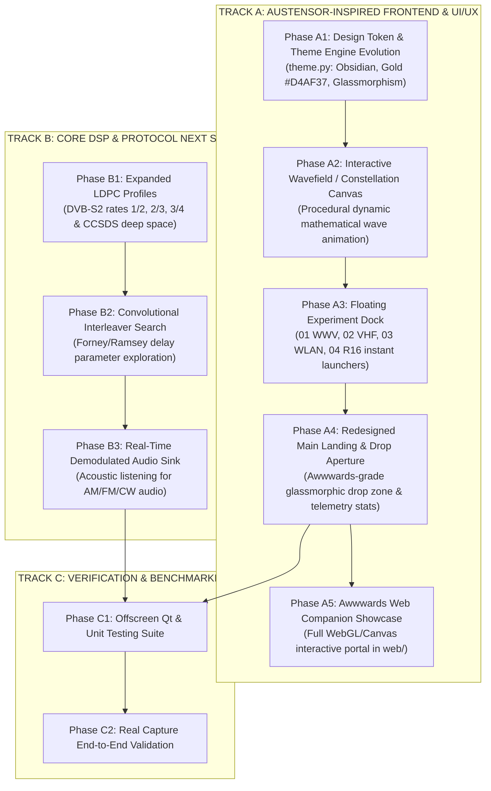

# Signal Lab: Frontend Aesthetics & Next Steps Strategic Roadmap
**Standard:** Austensor & Awwwards Design System | Senior Frontend & UI/UX Developer Architecture  
**Reference Benchmark:** [https://www.austensor.com/](https://www.austensor.com/)  
**Workspace:** `/home/alekh/projects/ps2`  
**Date:** September 2026  

---
https://www.austensor.com/page7
## 1. Vision & Creative Direction: "Waveform as Geometry, Bitstream as Space"

Taking direct inspiration from **Austensor** (Computational Art & WebGL Tensor Lab) and **Awwwards Site-of-the-Day** benchmarks, Signal Lab transcends standard clunky engineering GUIs (GNU Radio / Matlab) into a **museum-grade scientific instrument**. 

### Core Aesthetic Pillars:
1. **Obsidian & Carbon Surface Hierarchy**:
   - Deep `#000000` / `#05070A` true obsidian canvas.
   - Micro-frosted glassmorphic cards (`rgba(255, 255, 255, 0.03)` with `1px solid rgba(255, 255, 255, 0.08)` borders).
2. **Refined Dual Typography & Micro-Metadata**:
   - **Display Sans**: Crisp, modern tracking (`Inter` / `Outfit` / `Geist`) for titles and navigation.
   - **Monospace Coordinates**: Precision tabular typography (`JetBrains Mono`) with wide uppercase tracking (`tracking-[0.22em]`, font size 9px–10px) for technical telemetry (`EXP 01 // HF TERRESTRIAL`, `FS: 20.00 MSPS`, `SNR: +25.3 dB`).
3. **Austensor Golden Accents & Electric Signals**:
   - Primary Accent: **Imperial Gold / Golden Ratio $\phi$** (`#D4AF37`) for curatorial highlights, active states, and golden ratio marks.
   - Telemetry Signal: **Electric Cyan** (`#00F0FF`) and **Matrix Green** (`#30D158`) for verified convergence and carrier lock.
4. **Interactive Procedural Canvas**:
   - Real-time procedural mathematical wavefield/constellation background animating subtle mathematical tensor waves behind the landing screen.
5. **Floating Navigation Dock**:
   - Floating glassmorphic dock featuring numbered experiments (`01 WWV HF`, `02 LMR VHF`, `03 WLAN UHF`, `04 RadioMod-R16`), live audio tick equalizer animations, and 1-click instant demo loading.

---

## 2. Step-by-Step Execution Plan

---

## 3. Detailed Phase Breakdown

### Phase A1: Design Tokens & Palette Refinement (`signal_lab/gui/theme.py`)
- Define `AustensorPalette` with exact contrast ratios:
  - `BG_OBSIDIAN = "#030508"`
  - `BG_GLASS = "rgba(255, 255, 255, 0.03)"`
  - `BORDER_HAIRLINE = "rgba(255, 255, 255, 0.08)"`
  - `ACCENT_GOLD = "#D4AF37"` (Golden ratio $\phi$ accent)
  - `ACCENT_CYAN = "#00F0FF"`
  - `TEXT_MUTED_TAG = "rgba(255, 255, 255, 0.45)"`
- Implement QSS classes for frosted glass cards, pill badges, and hairline borders.

### Phase A2: Procedural Wavefield & Constellation Canvas (`signal_lab/gui/widgets/wavefield_canvas.py`)
- Implement a lightweight, high-performance Qt widget (`QPainter` with antialiasing) that renders a mesmerizing harmonic wave superposition and floating constellation particles in real time (30–60 FPS with minimal CPU usage $<1\%$).

### Phase A3: Floating Experiment Dock (`signal_lab/gui/widgets/experiment_dock.py`)
- Floating pill dock positioned at top/center of landing screen:
  - `[01] WWV HF (15 MHz)` — Ionospheric timecode pulse
  - `[02] LMR VHF (38 MHz)` — Terrestrial narrowband mobile
  - `[03] WLAN UHF (2.4 GHz)` — 320 MB zero-copy high throughput
  - `[04] R16 AMC` — 16-class neural classification benchmark
- Includes micro equalizer audio tick bars and 1-click session initialization.

### Phase A4: Beautified Main Landing Page / Drop Aperture (`signal_lab/gui/widgets/drop_zone.py`)
- Replaced basic dotted box with a futuristic cybernetic aperture:
  - Glowing radial gradient backdrop.
  - Curatorial proposition: *"Where computation transcends notation: Waveform as geometry, bitstream as space."*
  - Floating Golden Ratio button ($\phi$) opening the scientific methodology dossier.
  - Hardware & SIMD telemetry bar (showing active CPU cores, C++20 SIMD status, zero-copy buffer engine).
  - Recent sessions styled as glowing technical index cards with signal telemetry chips.

### Phase A5: Interactive Awwwards Web Companion Showcase (`web/`)
- Pure HTML5 / Canvas / Vanilla CSS web application following `<web_application_development>` rules:
  - Dark mode obsidian palette matching `austensor.com`.
  - Real-time interactive WebGL/Canvas harmonic wave simulator and constellation visualizer.
  - Interactive Blind Parameter Discovery tool and audio demodulation simulator.
  - Zero external heavy dependencies, responsive across desktop and tablet.

### Phase B1: Expanded LDPC Profiles (`signal_lab/fec/ldpc.py`)
- Implement standard DVB-S2 quasi-cyclic parity-check generators for rates 1/2, 2/3, and 3/4.
- Implement CCSDS standard parity-check matrix generator.

### Phase B2: Convolutional Interleaver Blind Search (`signal_lab/interleaving/blind_search.py`)
- Implement Forney/Ramsey convolutional interleaver delay line exploration ($B \times M$).
- Periodic variance and autocorrelation tests to detect branch delays blindly.

### Phase B3: Real-Time Audio Demodulation Sink (`signal_lab/gui/widgets/audio_player.py`)
- Implement an audio monitoring widget using `PySide6.QtMultimedia.QAudioSink` or standard WAV streaming for instant acoustic playback of demodulated AM/FM/FSK signals.

### Phase C: Verification
- Maintain 100% test passing rate across all unit and integration tests.
- Maintain 100% clean `ruff` linter compliance.
